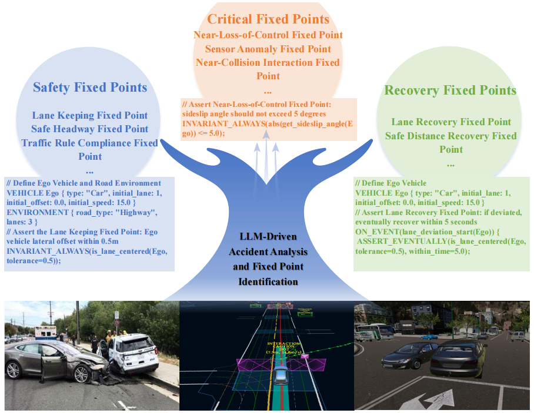

# INVARGEN: Fixed-Point Guided ADS Scenario Generation

[](https://conf.researchr.org/home/issta-2026)
[](https://www.python.org/)
[](LICENSE)

> **Note to Reviewers:** This repository contains the **replication package** for the paper *"Fixed-Point Guided ADS Scenario Generation via Multi-Modal LLM Reasoning and Software Testing"*. To maintain anonymity, all author information and institutional links have been redacted.

## 📖 Overview

**INVARGEN** is a novel framework that bridges semantic accident analysis and systematic software testing. It utilizes Multi-Modal LLMs to extract **"Scenario Fixed Points"** (safety invariants) from real-world accident data, which then guide a hybrid evolutionary search (Intelligent Fuzzing + Structural Mutation) to generate robust, critical, and executable test scenarios for Autonomous Driving Systems (ADS).

<p align="center">
  
</p>

### Key Features
* **LLM-Driven Specification:** Automatically extracts *Safety*, *Critical*, and *Recovery* fixed points from videos/images.
* **Hybrid Evolutionary Search:** Combines global exploration (NSGA-II) with local exploitation (Gradient-based Fuzzing).
* **Industry Standard Output:** Generates scenarios compatible with **OpenSCENARIO 1.x**, **OpenDRIVE**, and **ASAM OSI**.
* **Multi-Simulator Support:** Validated on **Carla** and **Panosim**.

---

## 🌟 Main Contributions

This repository implements the core innovations presented in our paper, specifically designed to address the "curse of dimensionality" and the "oracle problem" in ADS scenario generation:

* **Novel Framework Paradigm:** We propose INVARGEN, the first framework to utilize multi-modal LLMs as *active parametric specification generators* rather than passive scene translators. It seamlessly bridges semantic accident analysis with systematic software testing.
* **Dynamic Semantic Abstraction:** We introduce the concept of **Scenario Fixed Points**—context-aware safety invariants (e.g., adaptive safe headway thresholds) that are dynamically instantiated from unstructured accident videos. These adapt flexibly to environmental contexts (like weather or road friction) to provide precise guidance for robustness testing.
* **Hybrid Evolutionary Mechanism:** We implemented a Fixed-Point Guided Hybrid Search algorithm. It synergizes two distinct operators: *Intelligent Fuzzing* for the local exploitation of boundary parameters, and *LLM-Driven Structural Mutation* for the global exploration of diverse environmental contexts.
* **Rigorous Empirical Validation:** Through extensive evaluation involving 30 independent runs over 1,400 synthesized scenarios, INVARGEN statistically outperforms state-of-the-art baselines. It achieves a 30% fixed-point violation rate, discovers 37.8% more unique violation types, and maintains 100% compatibility with OpenX standards.

---


## ⚙️ Methodology & Pipeline Workflow

INVARGEN orchestrates a closed-loop pipeline designed to systematically generate and validate ADS test scenarios. The codebase is structured to reflect these four primary methodological stages:

### 1. LLM-Driven Accident Analysis & Fixed Point Identification
* **Input:** Ingests unstructured, multi-modal accident artifacts (dashcam videos, traffic footage, and textual reports).
* **Process:** The LLM performs deep causal reasoning to identify critical traffic states. It extracts three distinct categories of invariants: **Safety Fixed Points** (stable conditions like lane keeping), **Critical Fixed Points** (unstable boundary states like near-collisions), and **Recovery Fixed Points** (liveness properties indicating stabilization after perturbations).
* **Output:** Formalizes these invariants into an executable Domain-Specific Language (DSL) mapped to temporal logic predicates.

### 2. Scenario Prototype Generation
* **Process:** Transforms the formalized fixed points and accident cause chains into abstract, machine-readable blueprints (Scenario Prototypes). 
* **Symbolic Parameterization:** Instead of generating rigid concrete scenarios, it defines critical parameters (e.g., NPC speeds, cut-in durations) as searchable ranges, converting the generation task into a bounded parameter search problem.
* **Oracle Encapsulation:** The fixed points are explicitly embedded into these templates as targeted optimization objectives (Test Oracles).

### 3. SE Method-Driven Hybrid Search
* **Global Exploration (NSGA-II):** A multi-objective optimization loop prioritizing scenarios with high safety violation severity, high recovery difficulty, low Time-To-Collision (criticality), and high semantic diversity.
* **Local Exploitation (Intelligent Fuzzing):** Systematically perturbs continuous parameters sensitive to the fixed-point boundaries (e.g., calculating deceleration gradients) to push the ADS over the safety edge.
* **Structural Mutation:** The LLM acts as a semantic operator to inject high-level qualitative changes (e.g., altering vehicle types, injecting sensor noise, changing weather) when population diversity stalls.

### 4. Formalization & Realism Assurance
* **Kinematic Validation:** Acts as a gatekeeper to prevent "flying car" anomalies by enforcing strict physical bounds on longitudinal acceleration and lateral jerk.
* **Pre-Simulation Verification:** Performs lightweight logical checks to ensure the semantic consistency of the generated scenario before consuming heavy simulation resources.
* **Standardized Output:** Serializes the internal DSL into industry-standard **OpenSCENARIO 1.x** and **OpenDRIVE** formats, ensuring seamless execution in high-fidelity simulators like Carla and Panosim.


## 📂 Repository Structure

> **💡 Note for Peer Review:** To facilitate the double-blind review process while protecting intellectual property prior to publication, this repository currently contains a **core replication package**. It includes the essential algorithms, representative data samples, and a working demo. The complete codebase, full 200-case dataset, and exhaustive baseline scripts will be fully open-sourced upon the paper's acceptance.

The project is structured to mirror the pipeline described in **Section 3** of the paper:

```text
INVARGEN_Replication/
├── data/
│   ├── accident_samples/       # [Subset] A representative sample of UCF-Crime/CADP used for the demo
│   └── dsl_templates/          # [Available] Pre-defined scenario archetypes and DSL grammar
├── src/
│   ├── llm_agent/              # [Core] Core prompts and API integration for Fixed Point Extraction (Sec 3.2)
│   ├── generator/              # [Core] Prototype Generation & Serialization logic (Sec 3.3)
│   ├── search_engine/          # [Core] Hybrid Evolutionary Search algorithms (NSGA-II + Fuzzing) (Sec 3.4)
│   └── validator/              # [Partial] Basic kinematic checks & OpenSCENARIO compilation (Sec 3.5)
├── experiments/                # [Demo Scripts] Minimal scripts to demonstrate the evaluation workflow
├── outputs/                    # Examples of generated .xosc and .xodr files
└── requirements.txt            # Python dependencies

